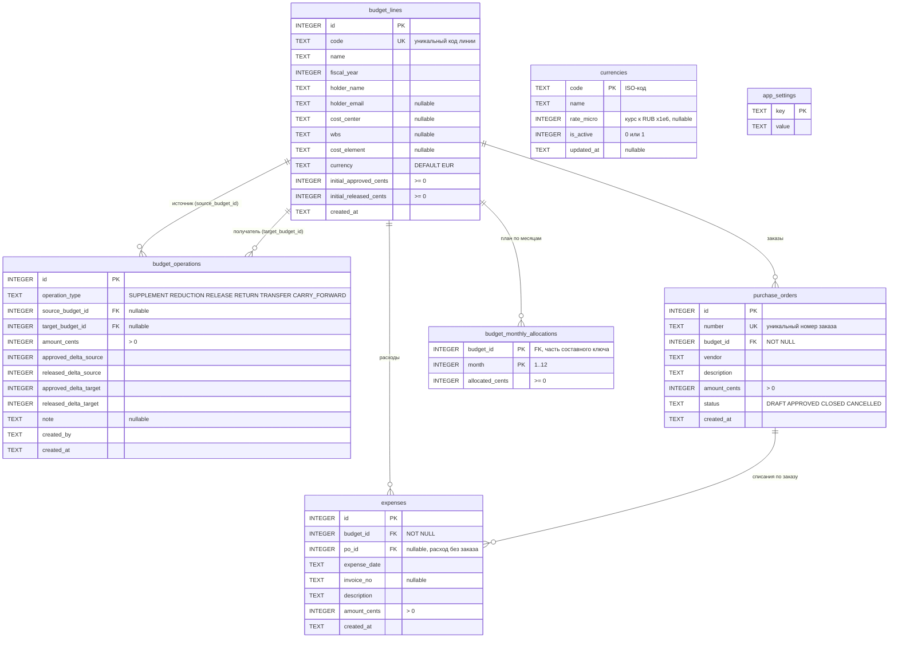

# Схема данных

Схема создаётся в `init_db()` (`app.py`) одним `executescript` и состоит из семи
таблиц SQLite. Все денежные суммы хранятся целыми числами в минимальных
единицах валюты (копейки/центы).

## ER-диаграмма

`currencies` и `app_settings` связаны с остальными таблицами только логически:
`budget_lines.currency` хранит ISO-код без внешнего ключа, а настройки — это
key-value с известными ключами `base_currency` и `rates_updated_at`.

## Назначение таблиц

| Таблица | Назначение |
| --- | --- |
| `budget_lines` | Бюджетная линия. Хранит только начальные суммы; текущие считаются на лету |
| `budget_operations` | Журнал движений бюджета с дельтами отдельно для источника и получателя |
| `purchase_orders` | Заказы поставщикам; обязательства формируют только со статусом `APPROVED` |
| `expenses` | Фактические расходы, с привязкой к заказу или без неё |
| `budget_monthly_allocations` | Помесячный план по линии, составной ключ `(budget_id, month)` |
| `currencies` | Справочник валют и курсы ЦБ РФ к рублю |
| `app_settings` | Key-value настройки приложения |

## Что считается, а не хранится

Текущее состояние бюджета в таблицах отсутствует — `budget_metrics()` собирает
его при каждом запросе:

| Показатель | Формула |
| --- | --- |
| `approved` | `initial_approved_cents` + Σ `approved_delta` (source + target) |
| `released` | `initial_released_cents` + Σ `released_delta` (source + target) |
| `actuals` | Σ `expenses.amount_cents` |
| `commitments` | Σ `max(po.amount_cents − Σ расходов по заказу, 0)` для `status = 'APPROVED'` |
| `available` | `released − actuals − commitments` |

## Как операции меняют суммы

`compute_operation_deltas()` превращает тип операции и сумму в четыре дельты,
которые записываются в `budget_operations`. Знак указан относительно суммы.

| Операция | Утв. источника | Выд. источника | Утв. получателя | Выд. получателя | Проверка |
| --- | --- | --- | --- | --- | --- |
| `SUPPLEMENT` | +сумма | +сумма | 0 | 0 | Дополнительное финансирование |
| `REDUCTION` | −сумма | −сумма | 0 | 0 | Остаток не ниже факта и обязательств |
| `RELEASE` | 0 | +сумма | 0 | 0 | Выделено не выше утверждённого |
| `RETURN` | 0 | −сумма | 0 | 0 | Нельзя вернуть израсходованное |
| `TRANSFER` | −сумма | −сумма | +сумма | +сумма | Одна валюта, достаточный остаток |
| `CARRY_FORWARD` | −сумма | −сумма | +сумма | +сумма | То же плюс `fiscal_year` получателя строго больше |

## Инварианты и хранение

- Деньги — целые числа в минимальных единицах; дробных типов в схеме нет.
- `assert_budget_ok()` после каждой записи проверяет `released <= approved` и
  `available >= 0`, иначе транзакция откатывается.
- Записи идут через `BEGIN IMMEDIATE`, поэтому проверка остатка и запись
  атомарны относительно других писателей.
- `PRAGMA foreign_keys = ON` включается на каждом соединении.
- Курсы валют хранятся к рублю целыми числами ×1 000 000, RUB зафиксирован
  как 1 000 000.
- Индексов, представлений и миграций нет: `init_db()` создаёт таблицы через
  `CREATE TABLE IF NOT EXISTS`.
